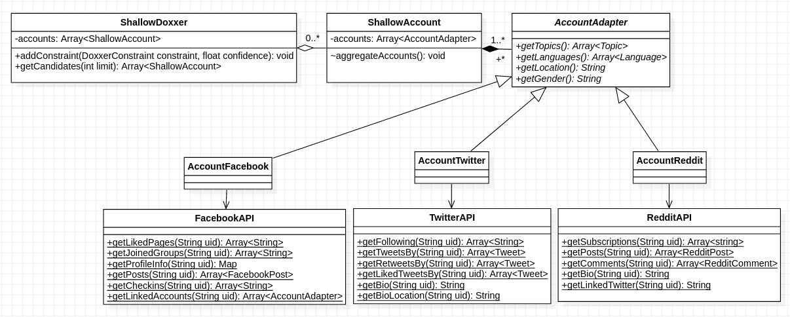
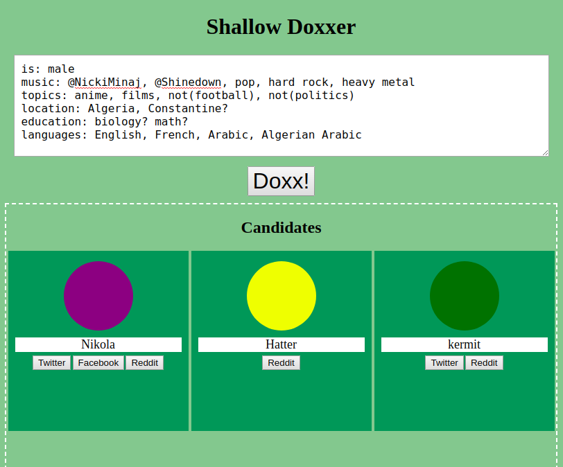

================================
  Shallow Doxxer - Tech Spec V0
================================

:Date: June 2019
:Author: Djalil Dreamski

Overview
========
Currently, when I meet an interesting new person on an "anonymous" website like Reddit,
I can't help but try to look for clues to who this person might be, things like their
education, their location, favorite artists and films, etc.
It's exhausting, we gotta automate this.

My hypothesis: People happily share honest information about themselves, that they think won't identify
them like hobbies, fave singers, languages they know (or don't know), and maybe even vaguely describe
their location and places they visit.

We need an app that exploits these innocuous pieces of information to find ("doxx")
people and locations.
Shallow Doxxer uses "shallow" information to find people and locations
by searching, filtering, and sorting nodes in social networks and maps.

Or more formally: The app should perform a De-anonymization attack;
it links an anonymous node to some profiles in heterogeneous social networks
with the help of background knowledge.

It can be used to catch terrorists, sex offenders, or to reconnect with that special person you once knew on Reddit.

Keywords: De-anonymization; Entity Resolution; social networks; Google Maps; Algeria;

Goals
=====
- Given a description, it filter profiles from heterogeneous sources (sns) to find "suspects" (i.e. candidates).

Out of Scope (Non-goals)
========================
- Automatic extractions of criteria (shallow attrs)
- Using complex metrics like stylometry, text understanding, sentiment analysis.

Problems and Open Questions
===========================

Legalities
----------
- In Algeria, you have that privacy shit, and you can be sued for defamation or something, as told on Reddit (redd.it/bysbxr).
- Do govts already use such things? (Probably)
- Some websites (like Facebook) prohibit collecting users' info. What should we do regarding that? Just ignore it?

Technicalities
--------------
- I virtually have no internet access; and even when I do, it's ~30kb/s at best.
- Limited quota; for example, Twitter has a '200 API calls per 15 mins' rate limit.
- Hard to deduce attributes on Facebook since most groups are private, friends are hidden, and posts are restricted.
- Poor tools for working with Arabic, let alone Arabic variations (Darja) which are often used online.
- Problem of normalizing data, especially across websites.
- SOLVED (check 'References'): How to make connections between different platforms? Using Twitter?
  Like, **Facebook:A** links to **Twitter:B** and **Reddit:C** links to **Twitter:B**, so **Person:X** is **{Facebook:A, Twitter:B, Reddit:C}**.

- What ID to use for **Person:X**? Facebook's? Twitter's? Google/YouTube's? Multiple ids? Create a special one?

Components
==========
It's like a search engine that takes some description of people/places.
::

  - [statement, handler, confidence]
  - confidence: [-1; +1]
  - statement = "They speak English"
  - handler = (posts) => posts.some(post=> isEnglish(post.text))
  - confidence = +1 // I'm *positive* they know English

---

Some statements are "time-fading"/"volatile", like, maybe I used to like Lady Gaga years ago but now I no longer listen to her music.
::

  - statement = "They like Lady Gaga"
  - X's latest post about Lady Gaga was in 2019? Confi = ~1
  - X's latest post about Lady Gaga was in 2015? Confi = ~0.25

(Something like :math:`C - C * f^t`, where C is confidence, f is the fading factor, and t is the time in months or years or whatever works.)

Doxxer::Person
--------------

* Take me for example: "Male, brown, from Algeria, likes Nicki Minaj, not into football, knows French, doesn't know Amazighit..."

* Gets a list of Algerians (from Facebook groups and pages) and Nicki Minaj's followers (on Instagram, Twitter, idk)

* Then orders them based on other details:

  - X is male or not specified? score++
  - X follows Algeria-related topics? score++
  - X uses French? score++
  - X uses Amazighit? score--
  - X likes football? score--
  - Catfish? (photo is of a celeb?) score--
  - Face++ confirms some physical descriptions we know ('brown')? Score++

.. code-block:: java

  class RedditProfile extends SomeProfile {
    Topics[] getTopics() {
      // rawTopics = (Active communities if public) or (subreddits they frequently post in or comment on)
      Topic[] topics = map(rawTopics, RedditProfile.normalizeTopic);
      return topics;
    }

    static String normalizeTopic(String sub) {
      if (sub.equals("r/algeria")) {
        return "enwiki/Algeria";
      else {
        // Find a way to map subs to Wikipedia articles
      }
    }
  }

  class TwitterProfile extends SomeProfile {
    Topics[] getTopics() {
      // rawTopics = (following) and/or (interactions, as in tweets, retweets, likes)
      // normalize topics
      return topics;
    }
    // ...
  }

**Basically, it follows the *Singleton*-ish pattern for "foreign APIs" and an *Adapter*-ish pattern for my classes**

*UML class model*

*A mockup of a minimalistic UI using a Domain Specific Language*

---

Adapter::Twitter::likes(x, y)
  - X follows Y
  - X interacts with Y (tweet, retweet, likes tweets)
  - X posts about Y (tags, mentions or quotes, links to Y, etc.)

For example: `Nikola likes @Shinedown`?
  - Nikola follows @Shinedown? Yes! [we can stop here]
  - Nikola interacts with @Shinedown (tweet, retweet, likes tweets)? No evidence found.
  - Nikola posts about @Shinedown?

    * One of Nikola's tweets contains #ATTENTIONATTENTION (which is an album released by Shinedown)?
    * Nikola posted a link to the Youtube channel `www.youtube.com/user/ShinedownTV` which links to this Tweeter account?

Example
.......
Let's try to find Zaki -- a guy from not-Reddit. This is what I learned while chatting with him:

..

  Zakaria (AKA Zaki), from Constantine, studying for a Master's in law at Mentouri University.
  He masters English and is talkative.
  He is into philosophy, especially Immanuel Kant's Categorical Imperative.
  He is 'geek' and 'skeptic'.

* Get users (let's say we start with Facebook)

  - Get members of law groups {confidence: 0.9}
  - Get members of Constantine groups and pages {confidence: 0.8}
  - Get members of Algerian/Arab 'skeptic' groups {confidence: 0.5}

* Filter

  - Remove females (keep males and unstated profiles) {confidence: 1}

* Sort

  - Likes philosophy? Likes Kant? {confidence: 1}
  - name is Zak/Zaki/Zakaria or something phonetically similar? {confidence: 0.75}
  - Posts in English? Writes long well-formatted posts maybe? {confidence: 1}
  - Relationship status is something other than single? {confidence: -0.25}
  - Posts about geeky stuff? {conference: 0.75}
  - Member of a skeptic group? {confidence: 0.5}

Doxxer::Location
----------------

Example
.......
A few years ago, I posted my "semi-autobiographical novella" (think, summer diaries) on FanFiction.Net (which I later removed).
If you collect the unintentional clues, you could come up with this description:

..

  I live in a small city that is either near a mountain or is on a mountain.
  There's a railroad that people jog by; the distance between the starting point
  (an out-of-service train station) and finish point (a bridge) is about 5 KMs.
  Also, it takes at least an hour to reach a (not necessarily 'any') beach by bus.

* Functions

  - **isMountainish(city)**: If getElevation(city) > 750M maybe
  - **isSmallCity(city)**: getPopulation(city) < 5OK
  - **getPopulation(...)**: Query a prepared datastore (basically just some parsed Algerian statistics publications).
  - **getElevation(city)**: Ask Google Maps
  - **getTimeToBeach(city, vehicle)**: Ask Google Maps how long it takes to go from 'city' to any beach by 'vehicle' (take the average or min value or idk)

* Obtain

  - Cities = Get a list of all Algerian cities and towns (as in *ONS2008*)
  - Bridges, Train Stations, and Railways from Google Maps

* Filter

  - SmallCities = Select only small cities

* Sort

  - If isMountainish _{conf: 0.5}_
  - If getTimeToBeach = 1 hour +-30mins _{conf: 0.25}_

* Got AK (my town) yet?

Metrics
=======
How can we know this shit works well? Maybe:

- At least one of the testing/known accounts gets returned among the first 200 candidates when provided with a sufficiently detailed description...

- Doesn't take more than an hour to return something promising...

Disclaimer
==========
This project is made for educational purposes. It is intended to be a mental exercise and
as a motivation for me to learn more about the different methods 'bad guys' could obtain
personal information and use it to identify users and deduce their attributes for whatever reason.

*I sincerely believe that if we teach how vulnerable things really are, we can make the internet a safer place.*\*\*

**I am not responsible for any use or misuse of this project.**

True Disclaimer
---------------
- This is a complete trash: repetitions, feels like a "tech spec x whitepaper x research paper x whatever".
- This thing is super messy, ReST is screwed up, needs to be rewritten from scratch.
- \*\* This sentence is partly plagiarized from some Trape's disclaimer.
- Most of the following papers were obtained from an arXiv.org search "de-anonymization" on Jun 14, 2019.

References
==========
::

  - B. Ott, “I’m Bart Simpson, who the hell are you?” A Study in Postmodern Identity (Re)Construction, vol. 37. 2003.

  - A. Narayanan and V. Shmatikov, “De-anonymizing Social Networks,” 2009 30th IEEE Symposium on Security and Privacy, pp. 173–187, May 2009.

  - O. Goga, H. Lei, S. Parthasarathi, G. Friedland, R. Sommer, and R. Teixeira, “Exploiting Innocuous Activity for Correlating Users Across Sites,” 2013. .

  - O. Peled, M. Fire, L. Rokach, and Y. Elovici, “Matching Entities Across Online Social Networks,” arXiv:1410.6717 [cs], Oct. 2014.

  - M. H. Veiga and C. Eickhoff, “A Cross-Platform Collection of Social Network Profiles,” Proceedings of the 39th International ACM SIGIR conference on Research and Development in Information Retrieval - SIGIR ’16, pp. 665–668, 2016.

  - F. Shirani, S. Garg, and E. Erkip, “An Information Theoretic Framework for Active De-anonymization in Social Networks Based on Group Memberships,” arXiv:1710.04163 [cs, math], Oct. 2017.

  - G. Beigi and H. Liu, “Privacy in Social Media: Identification, Mitigation and Applications,” arXiv:1808.02191 [cs], Aug. 2018.

  - A. Cutler and B. Kulis, “Inferring Human Traits From Facebook Statuses,” arXiv:1805.08718 [cs], May 2018.

  - K. Drakonakis, P. Ilia, S. Ioannidis, and J. Polakis, “Please Forget Where I Was Last Summer: The Privacy Risks of Public Location (Meta)Data,” arXiv:1901.00897 [cs], Jan. 2019.

  - D. Jurgens, E. Chandrasekharan, and L. Hemphill, “A Just and Comprehensive Strategy for Using NLP to Address Online Abuse,” arXiv:1906.01738 [cs], Jun. 2019.

  - ONS, “Population,” https://web.archive.org/web/20150924060651/http://www.ons.dz/IMG/armature2008-%20FINAL(1).pdf, 2008.

  - C. Groom, “On Writing Tech Specs,” https://codeburst.io/on-writing-tech-specs-6404c9791159

  - Trape: https://github.com/jofpin/trape

  - Sherlock: https://github.com/sherlock-project/sherlock

  - Prolog: https://dtai.cs.kuleuven.be/problog/
